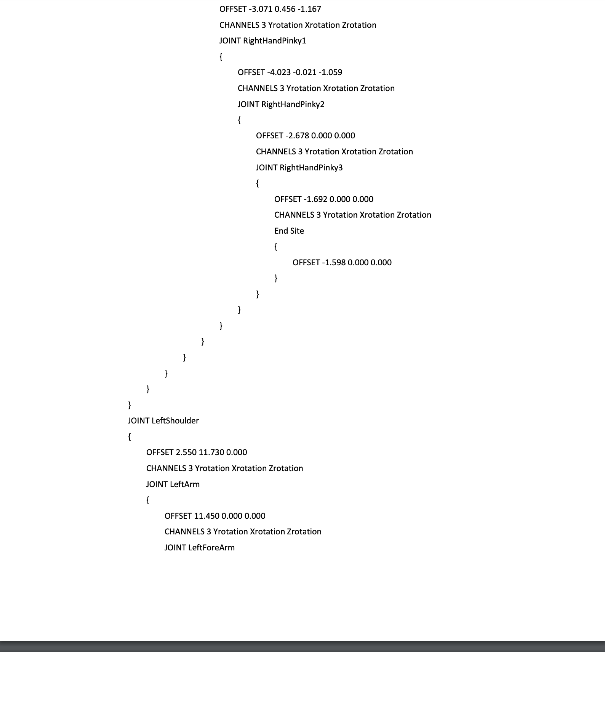

# Neuron Data Reader Runtime API

## Axis Neuronについて
Axis NeuronはTCP/IPまたはUDPプロトコルを介してBVHデータをストリーミング可能 

`NeuronDataReader`というAPIライブラリを使うとユーザーがBVHを受診して利用したり，サーバーとのコマンドでパラメータを同期したりする機能を使える．C言語の関数のみを提供している．

## スケルトンデータフォーマット

コールバックでBVH形式のアクションデータを出力する．

各フレームのデータストリームには`float`型のBVHヘッダとBVHモーションデータが含まれている．

プレフィックスや変位の設定など，スケルトンデータの全ての情報は，BvhDataHeaderExパラメータに含まれている．

フロートデータ配列のスケルトンデータのシーケンスは以下を参照．

以下に，ライブデータストリームで参照できるようにBVHヘッダデータのサンプルを示す．

ネットワークを介して，NeuronDataReaderは，Axis NeuronからBVHデータを受信する．

各フレームのBVHデータには，59個の骨の全ての運動データが含まれている．

変位を伴うBVHデータについては，各骨のデータには6個のfloatデータがある．

3つは変位(X,Y,Z)と3つの回転データ(デフォルトの回転順はY,X,Z)である．

変位のないBVHデータについては，`Hip`が変位と回転を持つ以外は，他の骨は回転のみのデータとなっている．

そこで，ユーザーは指定された骨の情報(位置やポーズ)を取得したい場合には，以下の式にしたがって，該当する数値指標を算出することができる．

1) BVH data with displacement

- Displacement_X = bone index * 6 + 0
- Displacement_Y = bone index * 6 + 1
- Displacement_Z = bone index * 6 + 2
- Rotation_Y = bone index * 6 + 3
- Rotation_X = bone index * 6 + 4
- Rotation_Z = bone index * 6 + 5
2) BVH data without displacement

Except rotation, only the hip node has displacement data.
- Root_Displacement_X = 0
- Root_Displacement_Y = 1
- Root_Displacement_Z = 2
- Rotation_Y = 3 + bone index * 3 + 0
- Rotation_X = 3 + bone index * 3 + 1
- Rotation_Z = 3 + bone index * 3 +2

3) introduce of BVH coordinate system
   

4) BVH data with Reference

骨格全体を移動また回転させ，骨格内の骨のデータを変更しないようにするために，ルートノードノオやノードとみなされる新しいノードをBVHデータ構造に追加することができる．

その結果，新しいノードの変異を変更する限り，全体のスケルトンモデルを翻訳することができる．

この新しいノードは`Reference`と定義されている．Referenceには変位データとポーズデータがある．したがって，上記BVHデータについては，データにReferenceが含まれている場合には，オフセットとして6を加算することで，スケルトンデータのインデックス番号が得られる．BVHデータの構造は上に示されている．

> 各ノードのポーズデータは親ノードを基準点とした相対的なものであり，ルートノードの腰のポーズは基準点を基準とした相対的なものなので，`定数`である．

## データ周波数

NeuronDataReaderから出力されるデータの周波数は，現在のユーザーが身につけているセンサの数に依存する．装置のノード数が18未満の場合，対応する取得周波数を120Hzとし，ノード数が18未満でない場合，取得周波数を60Hzとする．

これに対応して，コールバック関数の呼び出し周波数は，データ取得周波数と同じである．

特筆すべきは，ネットワークによるデータ伝送の過程で，フレームを失う確率が非常に低いことである．そのため，周波数は確かだが，NeuronDataReaderが受信するデータの数は変化する可能性がある．

## ユーザーアグリーメント

NeuronDataReaderはコールバック関数を使用してデータを出力する．そのため，サーバーに接続する前に，データを受診しておくためのローカル機能を登録しておく必要がある．

データ受診関数を登録している間に，クライアント・オブジェクトの参照をNeuronDataReaderライブラリに渡すことで，コールバック時にデータストリームと一緒にクラス・オブジェクトの参照を出力することができる．

NeuronDataReaderのデータ処理スレッドは，UIから切り離された作業スレッドである．そのため，ユーザー登録されたデータ受診機能は，UI要素に直接アクセスすることができない．しかし，コールバック関数のデータや状態をローカルの配列やバッファに保存することができるので，UIスレッドはローカルバッファに保存されたデータに他の場所からアクセスすることができる．

NeuronDataReaderライブラリには，パラメータやデータをサーバーと同期させるためのコマンドがいくつかある．`C#`や，Unityでは`C++`の動的なlib APIを直接呼び出すことができないので，NeuronDataReaderでは純粋な`C`インターフェースを使用している．

> NeuronDataReaderのデータ処理はマルチスレッド非同期なので，データ受診コールバック関数はUI要素に直接アクセスできない．UIスレッドで使用する必要がある場合は，コールバック関数のデータをローカル配列に保存しておくことが推奨されている．

